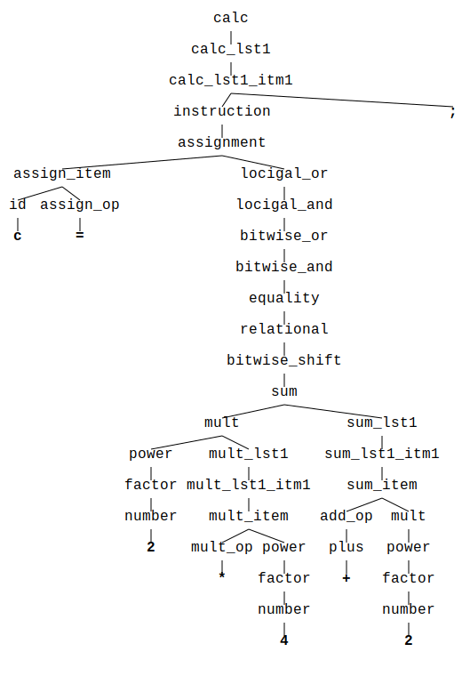

<!-- markdownlint-disable first-line-h1 -->
[](https://github.com/jsinger67/syntree_layout/actions/workflows/rust.yml)
[](https://docs.rs/syntree_layout)
[](https://crates.io/crates/syntree_layout)
<!-- markdownlint-enable first-line-h1 -->

# syntree_layout

A library to visualize tree structures, tailored for the
*[syntree](https://github.com/udoprog/syntree)* crate.

Please, see [CHANGELOG](CHANGELOG.md) for latest changes.

## Overview

This crate provides an additional way to represent trees visually, in the sense of `syntree`'s own
`print` methods.
It can help to understand their structures when trees start to grow.

And here is what the result may look like:



It turned out that the task to visualize trees is a universal one. So I decided to provide a
separate crate for the community.

An abstraction I wanted to face was the concrete node data type and how it should be presented for
a tree visualization.

I provide several ways to represent the nodes' data.

* Using the `Display` implementation of node's data type
* Using the `Debug` implementation of node's data type
* Using the `Visualize` implementation of node's data type
* Using directly provided methods
* As of version 0.3.0 this crate also provides visualization methods that uses the source code that
has been used to generate the syntax tree. To be able to use the new APIs the node data doesn't need
to implement the `Virtualize` trait. See `example3` in the examples folder.
The new APIs are `Layouter::embed_with_source` and  `Layouter::embed_with_source_and_display`

The `Visualize` trait only contains two methods and only one of them is mandatory to implement.
It is an additional way to flexibly hook into the mechanism of data representation.

The library provides another abstraction. It is about how an embedding of nodes in the plane is
presented to the user, i.e. in which format the embedding is converted in the end. For the sake of
simplicity the `syntree_layout` crate offers a simple default solution for this task, the
`SvgDrawer` type. It provides elementary representation of the embedding in SVG format. But if the
user wants to use its own realization, for instance to print the embedding onto a bitmap, he can
integrate into the graph generation easily. For this he needs to implement his own drawer algorithm
and implement the `Drawer` trait for it. Then he can use the `Layouter`'s `with_drawer` method to
supply it to the drawing procedure.

## Example Usage

```rust
use std::fmt;

use syntree::Builder;
use syntree_layout::{Layouter, Result, Visualize};

// `Debug` implementation is necessary if you want to use `Layouter::embed_with_debug`
#[derive(Debug)]
struct MyNodeData(i32);

// You need to implement syntree_layout::Visualize for your nodes data type if you want your own
// node representation.
// You should use `Layouter::embed_with_visualize`
impl Visualize for MyNodeData {
    fn visualize(&self, f: &mut fmt::Formatter<'_>) -> fmt::Result {
        write!(f, "Id({})", self.0)
    }

    fn emphasize(&self) -> bool {
        // This simply emphasizes only the leaf nodes.
        // It only works for this example.
        self.0 > 1
    }
}

// Display implementation is necessary if you want to use `Layouter::embed`
impl fmt::Display for MyNodeData {
    fn fmt(&self, f: &mut fmt::Formatter<'_>) -> fmt::Result {
        write!(f, "{}", self.0)
    }
}

fn main() -> Result<()> {
    //      0
    //     / \
    //    1   2
    //   / \
    //  3   4
    let mut tree = Builder::new();

    tree.open(MyNodeData(0)).unwrap();
    tree.open(MyNodeData(1)).unwrap();
    tree.token(MyNodeData(3), 1).unwrap();
    tree.token(MyNodeData(4), 1).unwrap();
    tree.close().unwrap();
    tree.token(MyNodeData(2), 1).unwrap();
    tree.close().unwrap();

    let tree = tree.build().unwrap();
    Layouter::new(&tree)
        .with_file_path("examples/example1_vis.svg")
        .embed_with_visualize()?
        .write()?;

    Layouter::new(&tree)
        .with_file_path("examples/example1_deb.svg")
        .embed_with_debug()?
        .write()?;

    Layouter::new(&tree)
        .with_file_path("examples/example1_dis.svg")
        .embed()?
        .write()
}
```
